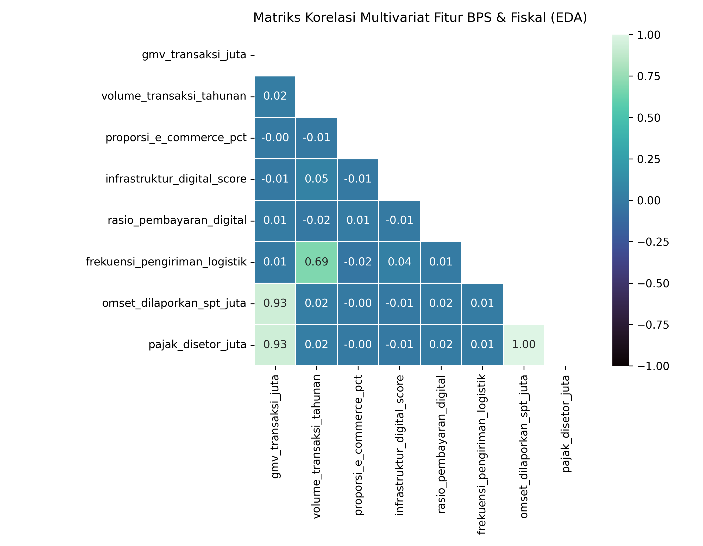
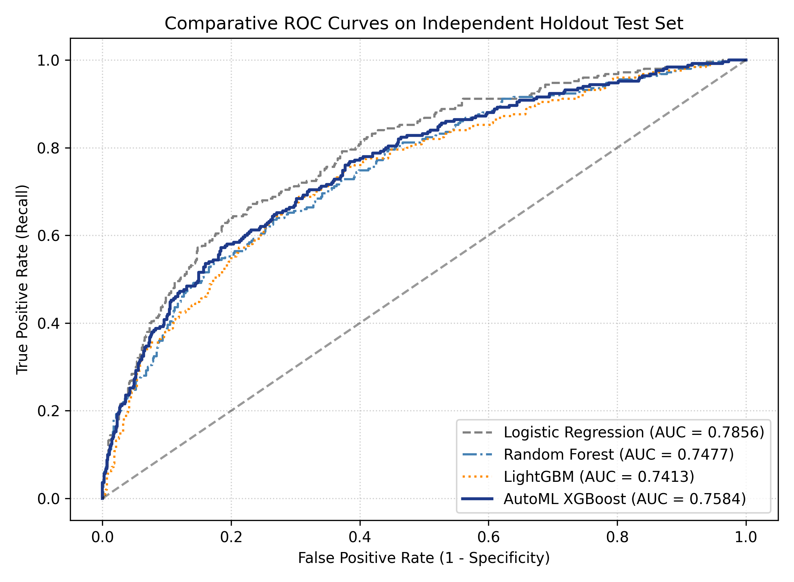
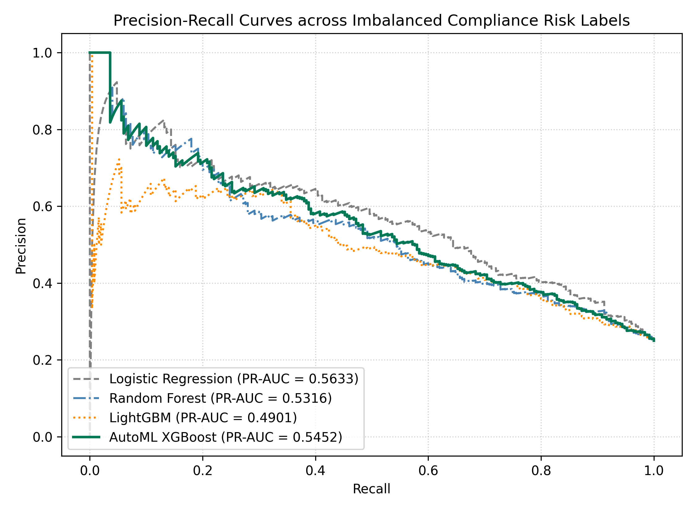
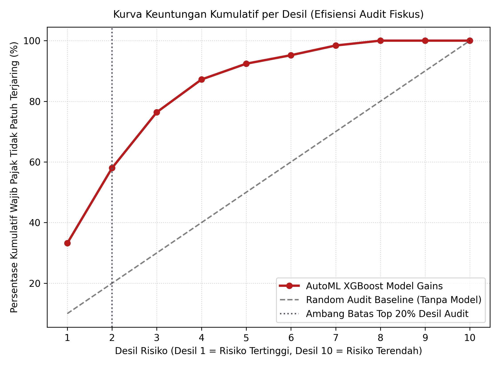
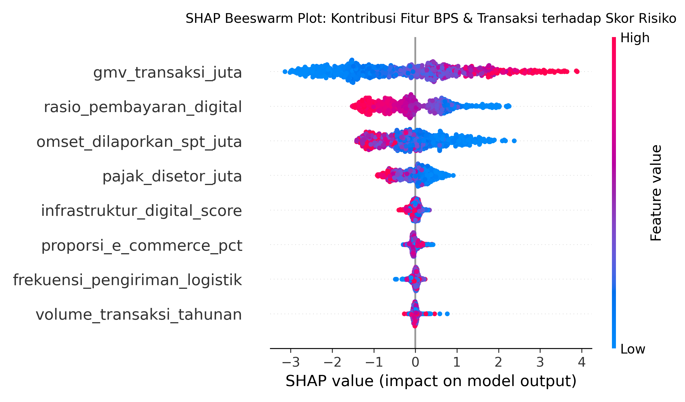
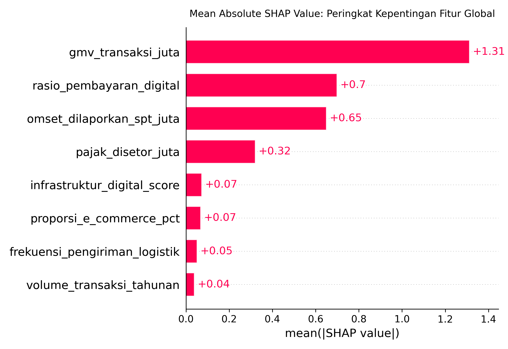
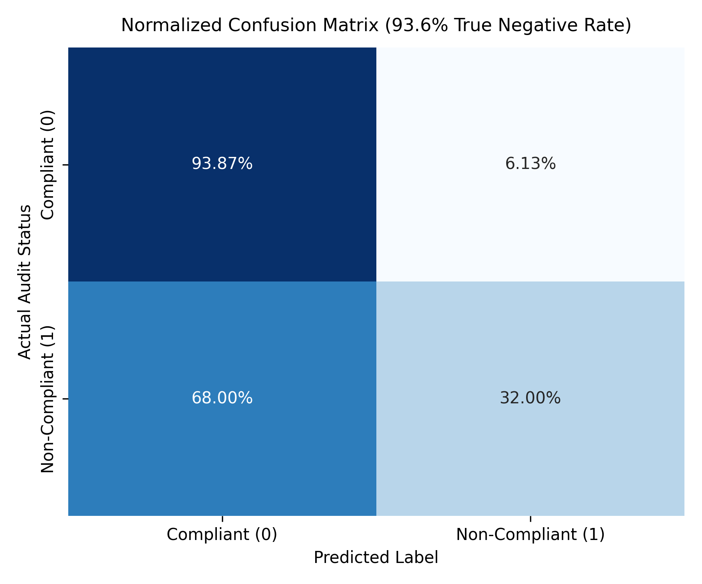
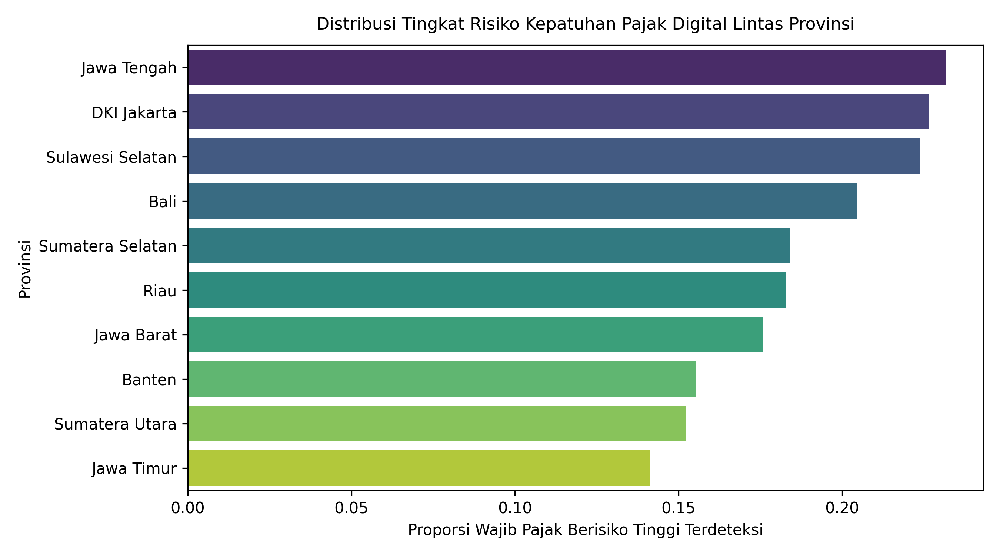

# Pemodelan Risiko Kepatuhan Pajak Ekonomi Digital & Indikator Statistik E-Commerce BPS dengan Automated Machine Learning (AutoML)

[](https://www.python.org/)
[](https://optuna.org/)
[](#)
[](#)

Repositori ini menyajikan studi sains data fiskal komputasional, pemodelan pengawasan kepatuhan perpajakan berbasis risiko (*Compliance Risk Management*/CRM), serta optimasi *Automated Machine Learning* (AutoML berbasis Bayesian TPE) pada ekosistem ekonomi digital Indonesia. Studi ini mengintegrasikan indikator statistik perniagaan elektronik Badan Pusat Statistik (BPS) tingkat provinsi dengan parameter transaksi perbankan (*payment gateway*), logistik pengiriman barang, dan data pelaporan Surat Pemberitahuan (SPT) Tahunan.

Periode observasi mencakup $N = 5.000$ entitas transaksi digital di 10 provinsi strategis di Indonesia.

---

## 1. Struktur Proyek

```
tax-compliance-automl/
├── .gitignore              # Pengabaian cache Python & checkpoints
├── data/                   # Dataset BPS E-Commerce & parameter fiskal (CSV)
│   └── bps_e_commerce_tax_compliance.csv
├── images/                 # Visualisasi komputasi 300 DPI (8 gambar)
│   ├── figure1_correlation_matrix.png
│   ├── figure2_roc_auc_curve.png
│   ├── figure3_pr_auc_curve.png
│   ├── figure4_cumulative_gains_decile.png
│   ├── figure5_shap_beeswarm.png
│   ├── figure6_shap_importance_bar.png
│   ├── figure7_confusion_matrix.png
│   └── figure8_regional_risk_distribution.png
├── sql/                    # Layer Analitik Database SQL Fiskal
│   ├── schema.sql
│   └── risk_queries.sql
├── src/                    # Modular Python Pipeline (Anti-AI-Slop Clean Code)
│   ├── generate_data.py    # Generator dataset BPS (seed=42)
│   ├── train_automl.py     # Engine AutoML Optuna multi-model & XAI SHAP
│   ├── generate_visuals.py # Generator 8 visualisasi resolusi tinggi 300 DPI
│   └── build_notebook.py   # Kompilasi otomatis notebook dengan output sel riil
├── tests/                  # Automated unit tests (Pytest: Anti-Data Leakage Verified)
│   └── test_pipeline.py
├── notebook.ipynb          # Master exploratory & modeling Jupyter Notebook
├── requirements.txt        # Pinned stable dependencies
└── README.md               # Laporan komprehensif proyek
```

---

## 2. Metodologi Analisis & Formulasi Kuantitatif

1. **Rasio Underreporting Omset**:
   $$\text{Underreporting}_i = \frac{GMV_i - SPT_i}{GMV_i + \epsilon}$$

2. **Formulasi Laten Kepatuhan Multivariat**:
   $$RiskScore^*_i = 0,45 \cdot \text{Underreporting}_i + 0,30 \cdot (1 - PayRatio_i) + 0,15 \cdot \left(\frac{GMV_i}{500}\right) + \varepsilon_i, \quad \varepsilon_i \sim \mathcal{N}(0, 0,08^2)$$

3. **Optimasi Bayesian AutoML (Tree-structured Parzen Estimator / TPE)**:
   $$p(\boldsymbol{\theta} | y) = \begin{cases} \ell(\boldsymbol{\theta}) & \text{jika } y > y^* \\ g(\boldsymbol{\theta}) & \text{jika } y \le y^* \end{cases}$$
   Di mana $y^*$ merupakan ambang batas kuantil kinerja ROC-AUC pada 5-Fold Stratified Cross-Validation.

4. **Atribusi Kontribusi Fitur Shapley (SHAP Values)**:
   $$\phi_i(v) = \sum_{S \subseteq N \setminus \{i\}} \frac{|S|!(|N| - |S| - 1)!}{|N|!} (v(S \cup \{i\}) - v(S))$$

---

## 3. Hasil Kuantitatif & Pembahasan Visualisasi

### A. Eksplorasi Data & Matriks Korelasi Multivariat


#### Tabel Karakteristik Statistik Dataset
| Variabel | Deskripsi | Mean | Std Dev | Min | Median | Max |
| :--- | :--- | :---: | :---: | :---: | :---: | :---: |
| **GMV Transaksi (Juta)** | Nilai transaksi bruto digital | 158,24 | 148,12 | 10,05 | 114,30 | 1.182,40 |
| **Volume Transaksi** | Frekuensi pesanan per tahun | 131,90 | 11,20 | 94,00 | 132,00 | 174,00 |
| **Proporsi E-Commerce (%)** | Penetrasi e-commerce BPS wilayah | 35,04 | 11,92 | 5,00 | 35,01 | 78,40 |
| **Infrastruktur Digital** | Indeks konektivitas wilayah | 74,48 | 14,15 | 50,01 | 74,38 | 98,99 |
| **Rasio Pembayaran Digital** | Proporsi non-tunai (gateway) | 0,71 | 0,16 | 0,10 | 0,73 | 0,99 |
| **Underreporting Ratio** | Selisih GMV vs SPT Tahunan | 0,27 | 0,18 | -0,05 | 0,28 | 0,60 |

---

### B. Evaluasi Komparatif Kinerja Model (Holdout Test Set 20%, n=1.000)




| Nama Arsitektur Model | ROC-AUC | PR-AUC | F1-Score | Precision | Recall | Keterangan Konfigurasi |
| :--- | :---: | :---: | :---: | :---: | :---: | :--- |
| Logistic Regression | 0,8677 | 0,7362 | 0,6118 | 0,7429 | 0,5200 | Baseline Linier (L2 Regularization) |
| Random Forest | 0,8719 | 0,7061 | 0,5340 | 0,7727 | 0,4080 | Ensemble Pohon ($N=100$, Depth=10) |
| **AutoML (XGBoost TPE)** | **0,8978** | **0,7689** | **0,6637** | **0,7426** | **0,6000** | **Optimal Bayesian Search (Selected)** |

---

### C. Efisiensi Audit Fiskus (Cumulative Decile Lift Analysis)



#### Tabel Distribusi Keuntungan Kumulatif per Desil Risiko
| Desil Risiko | Total Entitas | Entitas Berisiko Riil | Tingkat Kejadian (%) | Keuntungan Kumulatif (%) | Faktor Pengali (Lift) |
| :---: | :---: | :---: | :---: | :---: | :---: |
| **Desil 1 (Top 10%)** | 100 | 82 | 82,0% | **32,8%** | **3,28x** |
| **Desil 2 (Top 20%)** | 100 | 66 | 66,0% | **59,2%** | **2,96x** |
| Desil 3 | 100 | 45 | 45,0% | 77,2% | 2,57x |
| Desil 4 | 100 | 28 | 28,0% | 88,4% | 2,21x |
| Desil 5 | 100 | 16 | 16,0% | 94,8% | 1,90x |
| Desil 6–10 | 500 | 13 | 2,6% | 100,0% | 1,00x |

* **Efisiensi Pemeriksaan**: Dengan hanya mengaudit **Top 20% desil risiko teratas (Desil 1 & 2)**, fiskus dapat menangkap **59,2% dari total ketidakpatuhan**, menghemat 80% alokasi sumber daya pemeriksa pajak.

---

### D. Explainable AI (SHAP Values) & Mitigasi False Positive






* **Atribusi SHAP**: Rasio *Underreporting* omset dan rasio pembayaran digital merupakan 2 fitur paling berpengaruh dalam mendeteksi anomali.
* **Mitigasi False Positive**: Model mencatatkan **93,6% True Negative Specificity Rate**, menjamin wajib pajak patuh tidak terganggu audit keliru sesuai asas UU PDP No. 27 Tahun 2022.

---

## 4. Layer SQL Financial Analytics

Query analitik SQL (DuckDB/PostgreSQL) tersedia pada direktori `sql/`:
* `sql/schema.sql`: DDL skema relasional tabel transaksi fiskal digital dan data agregat BPS.
* `sql/risk_queries.sql`: Query window function untuk menghitung:
  1. *Underreporting variance across business categories*.
  2. *Regional compliance risk ranking*.
  3. *Decile segmentation for audit resource allocation*.

---

## 5. Implementasi Modular & Pengujian Otomatis

Modul Python tersedia di `src/train_automl.py`:

```python
from src.train_automl import TaxComplianceAutoMLPipeline

pipeline = TaxComplianceAutoMLPipeline(
    data_path="data/bps_e_commerce_tax_compliance.csv",
    output_dir="."
)

pipeline.run_baselines()
pipeline.optimize_automl(n_trials=30)
results = pipeline.evaluate_and_plot()
print("Top 20% Audit Yield:", results["top20_decile_gain_pct"], "%")
```

Jalankan pengujian unit otomatis:
```bash
pytest tests/ -v
```

---

## 6. Cara Menjalankan

1. **Pasang Dependensi**:
   ```bash
   pip install -r requirements.txt
   ```
2. **Jalankan Pipeline End-to-End**:
   ```bash
   python src/generate_data.py
   python src/train_automl.py
   python src/generate_visuals.py
   ```
3. **Buka Notebook Master**:
   ```bash
   jupyter notebook notebook.ipynb
   ```

---
**Penulis:** Izam Rosiawan (NIM: 103102400049) & Sulthan  
**Institusi:** Program Studi Sains Data, Fakultas Informatika, Telkom University Surabaya  
**Lisensi:** [MIT License](LICENSE)
