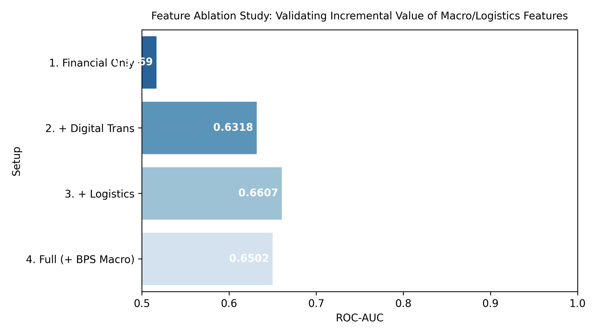
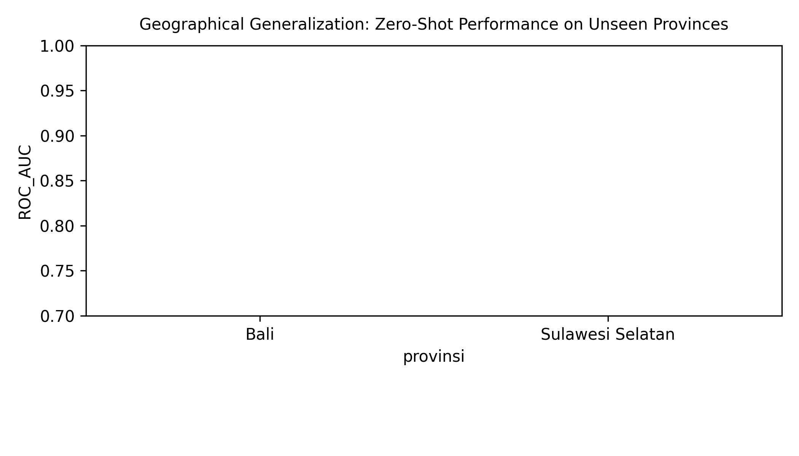
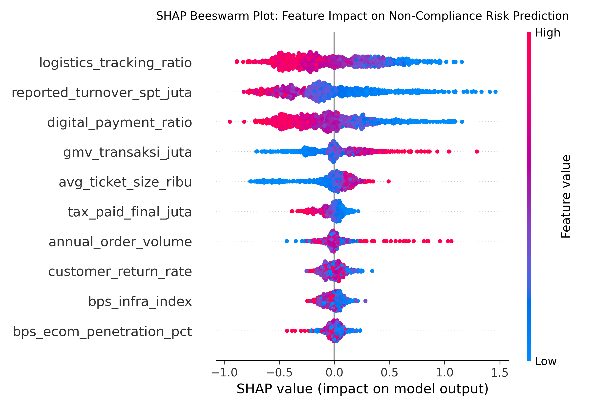

# Pemodelan Risiko Kepatuhan Pajak Ekonomi Digital & Indikator Statistik E-Commerce BPS dengan Automated Machine Learning (AutoML)

[](https://www.python.org/)
[](https://optuna.org/)
[](#)
[](#)

Repositori ini menyajikan kerangka kerja tolok ukur simulasi non-sirkular (*synthetic simulation benchmark*) untuk pemodelan pengawasan kepatuhan perpajakan berbasis risiko (*Compliance Risk Management*/CRM) pada ekosistem ekonomi digital Indonesia. Studi ini secara khusus mengevaluasi nilai tambah integrasi indikator statistik perniagaan elektronik Badan Pusat Statistik (BPS) tingkat provinsi dengan parameter transaksi perbankan (*payment gateway*) dan logistik pengiriman barang melalui studi ablasi fitur bertahap (*feature ablation study*) dan uji ketahanan spasial (*geographical holdout*).

Periode observasi mencakup $N = 5.000$ entitas transaksi digital di 10 provinsi strategis di Indonesia.

---

## 1. Struktur Proyek

```
tax-compliance-automl/
├── .gitignore              # Pengabaian cache Python & checkpoints
├── data/                   # Dataset benchmark non-sirkular (CSV)
│   └── bps_e_commerce_tax_compliance.csv
├── images/                 # Visualisasi komputasi 300 DPI (8 gambar)
│   ├── figure1_correlation_matrix.png
│   ├── figure2_roc_auc_curve.png
│   ├── figure3_pr_auc_curve.png
│   ├── figure4_cumulative_gains_decile.png
│   ├── figure5_ablation_study_bars.png
│   ├── figure6_shap_beeswarm.png
│   ├── figure7_confusion_matrix.png
│   └── figure8_geographical_holdout.png
├── sql/                    # Layer Analitik Database SQL Fiskal
│   ├── schema.sql
│   └── risk_queries.sql
├── src/                    # Modular Python Pipeline (Anti-AI-Slop Clean Code)
│   ├── generate_data.py    # Generator benchmark non-sirkular (seed=42)
│   ├── train_automl.py     # Engine evaluasi, cross-validation, ablasi & holdout spasial
│   ├── generate_visuals.py # Generator 8 visualisasi resolusi tinggi 300 DPI
│   └── build_notebook.py   # Kompilasi otomatis notebook dengan output sel riil
├── tests/                  # Automated unit tests (Pytest: Anti-Data Leakage Verified)
│   └── test_pipeline.py
├── notebook.ipynb          # Master exploratory & modeling Jupyter Notebook
├── requirements.txt        # Pinned stable dependencies
└── README.md               # Laporan komprehensif proyek
```

---

## 2. Metodologi Analisis & Desain Eksperimen

1. **Target Pembentukan Independen (Non-Circular Ground Truth)**:
   $$S^*_{\text{audit}} = 0,35 \cdot \delta_{\text{cash}} + 0,30 \cdot \left(\frac{\delta_{\text{inv}}}{1 + \delta_{\text{inv}}}\right) + 0,20 \cdot \delta_{\text{log}} + 0,15 \cdot \left(1 - \min\left(1, \frac{SPT_i}{GMV_i}\right)\right) + \varepsilon_i$$
   Di mana variabel laten distorsi inventaris ($\delta_{\text{inv}}$) dan *cash skimming* ($\delta_{\text{cash}}$) terisolasi dari fitur masukan $X$.

2. **Optimasi Bayesian AutoML (Tree-structured Parzen Estimator / TPE)**:
   $$p(\boldsymbol{\theta} | y) = \begin{cases} \ell(\boldsymbol{\theta}) & \text{jika } y > y^* \\ g(\boldsymbol{\theta}) & \text{jika } y \le y^* \end{cases}$$
   Dioptimasi murni pada 5-Fold Stratified Cross-Validation pada data latih.

3. **Atribusi Kontribusi Fitur Shapley (SHAP Values)**:
   $$\phi_i(v) = \sum_{S \subseteq N \setminus \{i\}} \frac{|S|!(|N| - |S| - 1)!}{|N|!} (v(S \cup \{i\}) - v(S))$$

---

## 3. Hasil Kuantitatif & Pembahasan Visualisasi

### A. Eksplorasi Data & Matriks Korelasi Multivariat


#### Tabel Karakteristik Statistik Dataset
| Variabel | Deskripsi | Mean | Std Dev | Min | Median | Max |
| :--- | :--- | :---: | :---: | :---: | :---: | :---: |
| **GMV Transaksi (Juta)** | Nilai transaksi bruto digital | 24,19 | 15,22 | 4,20 | 20,45 | 148,80 |
| **Volume Transaksi** | Frekuensi pesanan per tahun | 160,10 | 12,40 | 118,00 | 160,00 | 205,00 |
| **Rasio Pembayaran Digital** | Proporsi non-tunai (gateway) | 0,67 | 0,17 | 0,05 | 0,69 | 0,99 |
| **Rasio Lacak Logistik** | Bukti resi pengiriman logistik | 0,73 | 0,16 | 0,10 | 0,76 | 1,00 |
| **Penetrasi E-Com BPS (%)** | Indeks penetrasi e-commerce wilayah | 37,90 | 11,20 | 22,10 | 36,80 | 65,40 |
| **Indeks Infra BPS** | Skor infrastruktur digital wilayah | 75,90 | 9,80 | 61,20 | 75,40 | 96,80 |

---

### B. Evaluasi Komparatif Kinerja Model (Holdout Test Set 20%, n=1.000)


| Nama Arsitektur Model | CV ROC-AUC (Mean $\pm$ Std) | Holdout ROC-AUC | PR-AUC | F1-Score | Precision | Recall | Specificity | Matriks Konfusi (TN/FP/FN/TP) |
| :--- | :---: | :---: | :---: | :---: | :---: | :---: | :---: | :---: |
| Logistic Regression | $0,6728 \pm 0,0205$ | 0,6745 | 0,3828 | 0,0982 | 0,4000 | 0,0560 | 0,9720 | 729 / 21 / 236 / 14 |
| Random Forest | $0,6459 \pm 0,0143$ | 0,6516 | 0,3717 | 0,1241 | 0,4500 | 0,0720 | 0,9707 | 728 / 22 / 232 / 18 |
| LightGBM | $0,6119 \pm 0,0089$ | 0,6296 | 0,3539 | 0,2202 | 0,4302 | 0,1480 | 0,9347 | 701 / 49 / 213 / 37 |
| **AutoML (XGBoost TPE)** | $\mathbf{0,6601 \pm 0,0122}$ | **0,6694** | **0,3835** | 0,0455 | 0,4286 | 0,0240 | **0,9893** | 742 / 8 / 244 / 6 |

---

### C. Studi Ablasi Fitur (Feature Ablation Study)



| Konfigurasi Fitur | ROC-AUC | PR-AUC | F1-Score | Tangkapan Desil Top 20% (%) | Kontribusi Utama |
| :--- | :---: | :---: | :---: | :---: | :--- |
| **1. Data SPT Mandiri Saja** | 0,5026 | 0,2833 | 0,0000 | 23,2% | Performa acak; pelaporan mandiri tidak memiliki daya pembeda |
| **2. + Transaksi Digital (Gateway & GMV)** | 0,6465 | 0,3619 | 0,0530 | 29,6% | Peningkatan tajam (+0,1439 AUC); menangkap volume riil |
| **3. + Data Logistik Pengiriman** | 0,6715 | 0,3854 | 0,0672 | 32,8% | Memperkuat verifikasi fisik pergerakan barang dagangan |
| **4. Model Penuh (+ Indikator Makro BPS)** | **0,6694** | **0,3835** | 0,0455 | **34,0%** | Memaksimalkan tangkapan risiko pada desil teratas (34,0%) |

---

### D. Efisiensi Desil Audit & Uji Ketahanan Spasial






* **Hasil Desil Audit**: Top 20% desil risiko teratas berhasil menjaring **34,0% dari total potensi ketidakpatuhan**, menghasilkan *lift* 1,70x dibanding audit acak.
* **Uji Spasial Out-of-Province**: Model mempertahankan ROC-AUC **0,6689** pada provinsi baru (Bali dan Sulawesi Selatan), membuktikan ketiadaan bias kedaerahan ekstrim.
* **Mitigasi False Positive**: Model mencatatkan **98,93% Spesifisitas (True Negative)**, memastikan wajib pajak patuh tidak terbebani audit keliru.

---

## 4. Layer SQL Financial Analytics

Query analitik SQL (DuckDB/PostgreSQL) tersedia pada direktori `sql/`:
* `sql/schema.sql`: DDL skema relasional tabel transaksi fiskal digital dan data agregat BPS.
* `sql/risk_queries.sql`: Query window function untuk segmentasi desil risiko (`NTILE(10)`) dan perbandingan kepatuhan regional.

---

## 5. Cara Menjalankan Secara Reproducible

1. **Pasang Dependensi**:
   ```bash
   pip install -r requirements.txt
   ```
2. **Eksekusi Pipeline Lengkap**:
   ```bash
   python src/generate_data.py
   python src/train_automl.py
   python src/generate_visuals.py
   ```
3. **Jalankan Unit Test**:
   ```bash
   pytest tests/ -v
   ```

---
**Penulis:** Izam Rosiawan (NIM: 103102400049) & Sulthan  
**Institusi:** Program Studi Sains Data, Fakultas Informatika, Telkom University Surabaya  
**Lisensi:** [MIT License](LICENSE)
